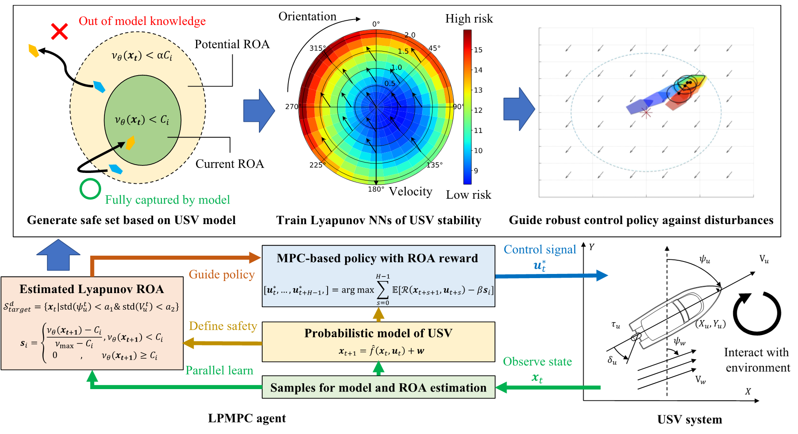
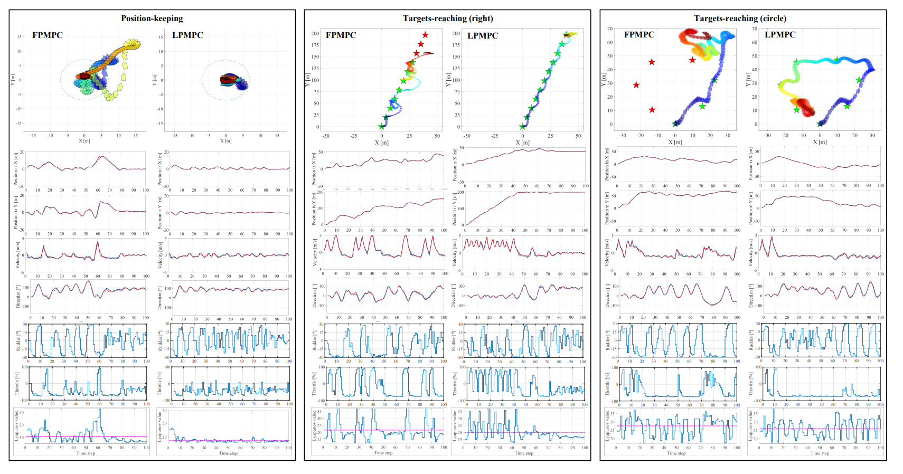
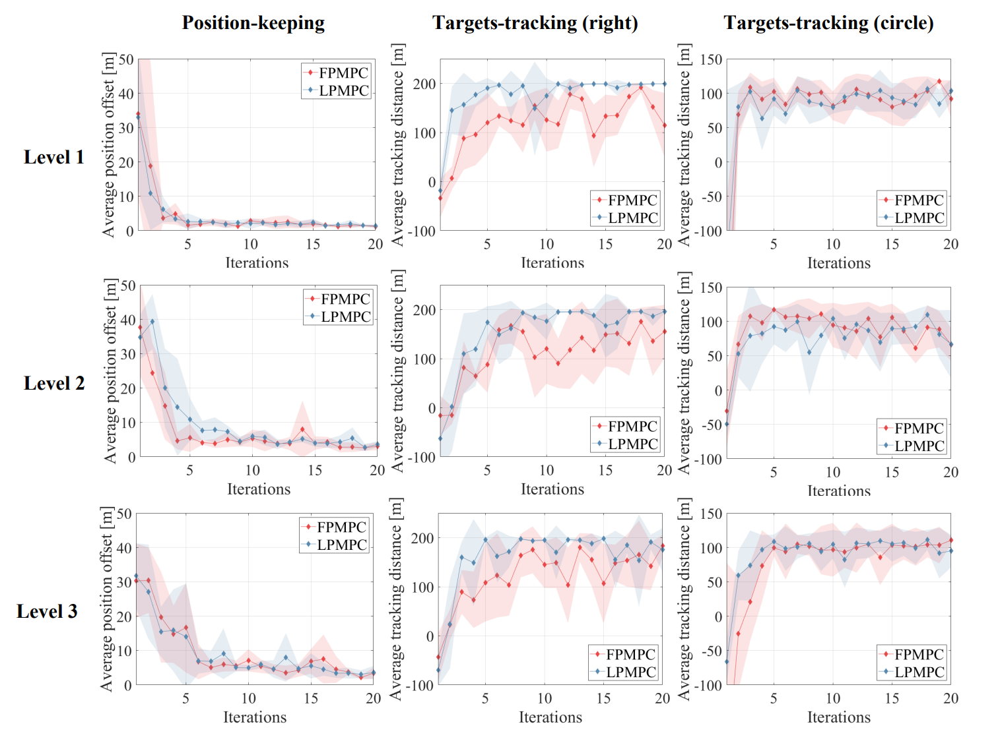
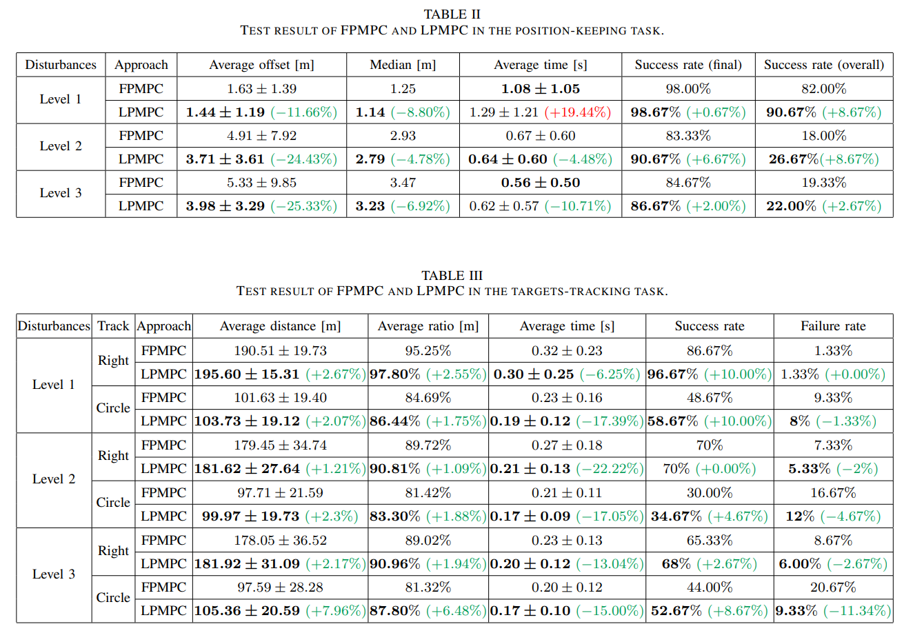
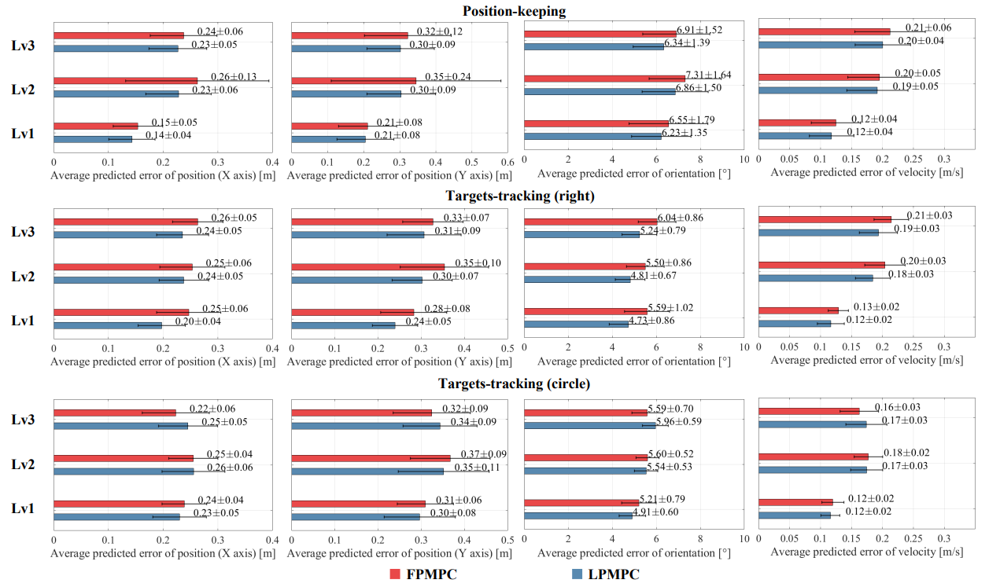
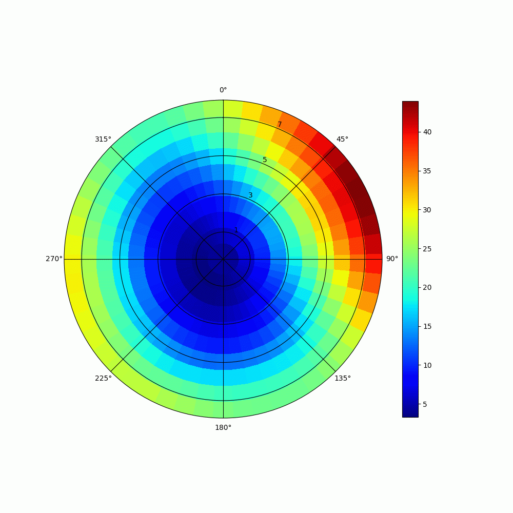
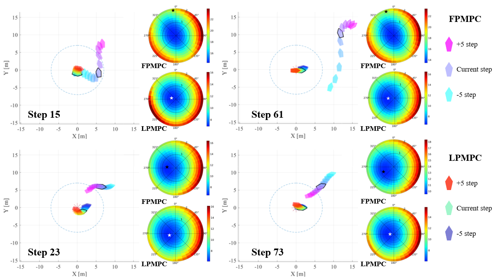
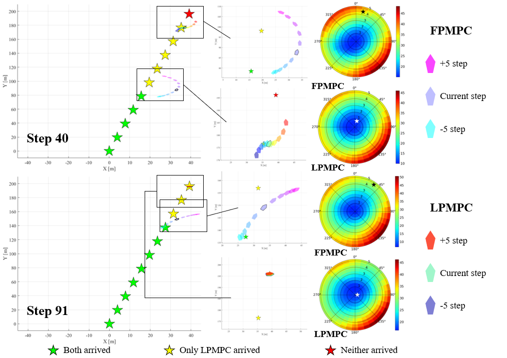
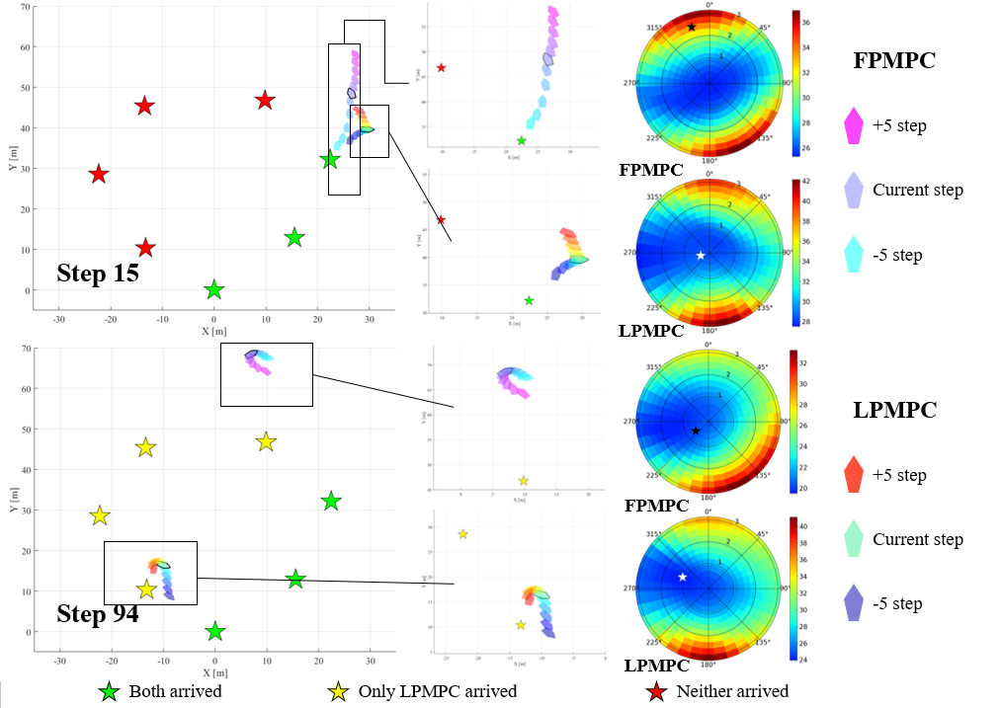

# Lyapunov神经网络
------
## 整体框架

该图片介绍了我们算法LPMPC(Lyapunov probabilistic model predictive control)的整体框架.
- 左上角中的绿色区域表示了安全区域(由安全状态组成),该区域由神经网络的输出来确定,黄色区域表示了潜在安全区域.通过潜在安全区域中的状态在未来X步后能否到达安全区域,来对安全集进行扩充.展示了Lyapunov神经网络的训练方法.
- 中间的极坐标热力图的极轴为速度,角度则表示了风的方向,箭头表示是此时实际风的方向,值是李雅普诺夫神经网络的输出,代表着危险程度.此图表示的是在此时的风力影响下,神经网络分出的安全区域以及危险区域,展示了神经网络的输出结果.
- 右上角图片是在完成位置保持任务,目的是让无人船保持在圈内,从紫到红表示按时间线船的轨迹, 无人船的控制动作需要根据神经网络的输出.
- 右下角表示了船的状态空间S = [X,Y,sd,V,wx,wy,eng,rra], x轴坐标, y轴坐标, 速度方向,速度, 风在x轴的大小, 风在y轴的大小,发动机,舵角.
- 左下角及中间部分展示了算法中更为具体的一部分,简而言之就是将神经网络的输出放置在有模型强化学习的奖励函数中,具体算法待公开.

------

##实验结果展示

上图展示无人船执行的三种任务,以及相应的无人船轨迹及控制信号对比:
- 任务:一共有两类任务,第一类任务为状态保持任务,我们希望无人船能尽可能的保持在原点附近,在里原点7m以内的范围都是符合要求的区域;第二类任务是多目标追踪任务,设置多个目标点, 无人船只有到达当前目标点附近才知道下一个位置,分为:右:一共有11个目标点,依次排列在右边; 圈:7个目标点, 排成一圈.
- 图中所展示的是一个epoch的完整轨迹,按照时间线从紫色到红色,可以观测到LPMPC算法有着更高的成功率、完成率;同时观察控制信号可以发现LPMPC的控制更为稳定、平滑;LPMPC算法的Lyapunov值也显著降低.

在3种不同环境下,LPMPC算法针对不同任务的学习曲线.

不同任务的测试结果:
- 位置保持任务中的success rate(final)代表每个epoch的最终位置在原点7m以内占整体的比例; success rate(overall)代表每个epoch过程中从不超出原点7m以外的状态占整体的比例.
- 追踪任务中success rate表示每个epoch完成率超过95%的占整体的比例; failure rate表示每个epoch完成率低于60%占整体的比例.
- 在各个任务上基本完成完全的超越.

无人船控制算法是基于高斯过程模型的强化学习, LPMPC算法在优化船的实际运行结果同时也显著降低了模型预测误差.
<!--  -->

根据风的方向的变化, 安全区域也随之变化

白色代表LPMPC算法, 黑色代表baseline,可以看出我们的算法具有足够的稳定性.

位置保持任务,从1个epoch中截取几个步数,观测两种方法的轨迹对比:
- 15步和61步展示了baseline算法在失控状态下,它的速度以及行驶方向在李雅普诺夫网络中也处于不安全地区, LPMPC算法一直保持稳定在原点附近,它的速度以及行驶方向同样在李雅普诺夫神经网络中保持安全状态.
- 23步和73步展示了baseline从失控状态逐渐回到安全状态,它的速度以及行驶方向在李雅普诺夫神经网络中也处于安全状态.

和上述一致,体现出LPMPC的优越性,同时也更快的完成了任务

94步时baseline处于失控状态,它的速度与方向是在朝向目标点,所以李雅普诺夫神经网络中也处于安全状态, 但是由于距离过远,一直也无法到达目标点.

-------

展示了整体框架与主要实验结果,具体算法流程后续进行更新.